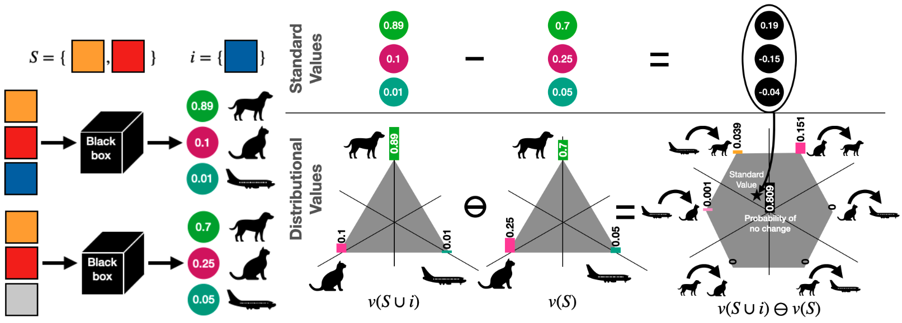

# Explaining Probabilistic Models with Distributional Values

Implementation of the [distributional values framework for XAI](https://arxiv.org/pdf/2402.09947)

 

Distributional values operators extend the classic value operators (like the [Shapley value](https://en.wikipedia.org/wiki/Shapley_value)) in cooperative game theory to process cooperative game with stochastic payoffs. 

A distributional value of a player of a cooperative stochastic game is a random variable representing the contribution of that player toward achieving the grand payoff, i.e. the payoff attained when all players play the game. 

In the context of explainability, one may derive stochastic games from probabilistic (binary or multiclass) classifiers, like neural nets.
The common usage in XAI is to identify players with input features and compute attributions for such features. 
In this context, distributional values can help answer questions such as:
- ''what is the probability that a feature does not contribute in changing prediction?''
- ''what is the feature that impacted the most for making $x$ being classified as an airplane *rather than* a dog?''
- ''what is the variance of the contribution of the input features?''.

Furthermore, the expectation of a distributional value yields a standard value, linking the two concepts closely and making the distributional values a strict extension of the standard one.  

## Quickstart

Example of the [Bernoulli Shapley value for a XOR game](dvals/examples/xor.ipynb)

#### Other examples

- [Categorical Shapley value for Iris multinomial regression](dvals/examples/iris.ipynb)
- [Categorical Shapley value for Mnist (explaining the 8)](dvals/examples/mnist.ipynb)

Please open an issue should you be interested in code covering the other case studies in the paper. 

### [Paper](https://arxiv.org/pdf/2402.09947)


```
@article{franceschi2024explaining,
  title={Explaining Probabilistic Models with Distributional Values},
  author={Franceschi, Luca and Donini, Michele and Archambeau, C{\'e}dric and Seeger, Matthias},
  journal={ICML},
  year={2024}
}
```

#### License
Please see [LICENSE](LICENSE)

##### Notice
This code is being released solely for academic and scientific reproducibility purposes, in support of the methods and findings described in the associated publication. Pull requests are not being accepted in order to maintain the code exactly as it was used in the paper, but interested parties are encouraged to open an issue requesting open source community development.

